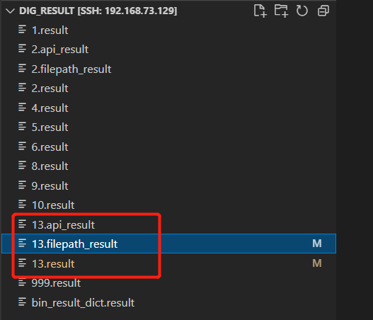

# IOTparser Instructions
## 1. dig 

```
sudo python3 dig.py -d ../../firmwares/_DSL-3782_A1_EU_1.01_07282016.zip.extracted/_DSL-3782_A1_EU_1.01_07282016.bin.extracted/squashfs-root/ -id 13
```

output:


> 13.result -> Binary file and corresponding shared keyword dictionary

> 13.api_result ->          Interfaces

> 13.filepath_result ->     Page paths


## 2. fuzz


### 2.1 simulation:
`sudo ./run.sh -a asus ../gyf/firmwares/FW_RT_N53_30043763754.zip`

Keep the simulation environment up and running：

`sudo python3 keep_alive.py -ip  192.168.1.1 -t 3`

### 2.2 In the first stage, the crawler collects requests：

`sudo python3 fuzzer.py  -s 0.0.0.0:7778 --html -id 2`

run after adding status field to rad config file:

`./rad -t http://192.168.1.1  -http-proxy 127.0.0.1:7778  --wait-login -json rtn53.json`

After completion, get the pkl file and save the obtained request

### 2.3 In the second stage, the crawler automatically parses all page paths and interfaces：

`sudo python3 fuzzer.py  -s 0.0.0.0:7778 --html -id 2`

`python3 api_request_headless.py -ip 192.168.1.1 -id 2`

After the end, a new api.pkl file is obtained, which saves high-coverage seeds

### 2.4 In the third stage, fuzz
```
-prio   Whether to enable priority scheduling
-api    Whether to add interface and page path
sudo python3 fuzzer.py  -s 0.0.0.0:7778 --html -id 2 -api 0 -prio 0
```

The fuzz request information is saved in fuzzlog.txt and fuzz results are stored in the output directory, displayed in the form of html files.

